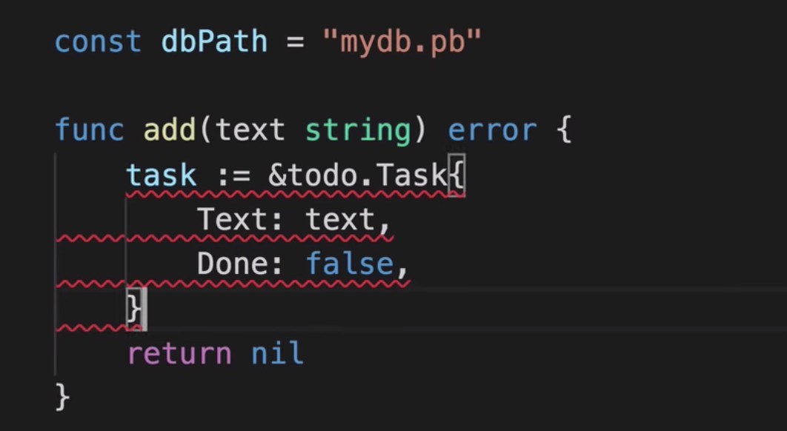

# gate_et_auth_grpc_v1
combine to user_grpc_v1 for basic token checking and user_information storing 

---

- /register call register api  
    - save register information into user_db via grpc grpc_user_v1
    - request to AUTH (uuid, email, password, account_id ) to USER ( all information )
        - email
        - id
        - cell_phone

    - response
        - email
        - password
        - error_code

    
- /login call get_token_api (match user_name and password)

    - use email and password to login
    - request to AUTH 
        - email
        - password

    - response
        - jwt_token
        - error_code
        - account_id

- /user/updated 
    - request to USER
        - jew_token
        - account_id
        - error_code
        - address
        - country
    - response
        - account_id
        - error_code

- /resource call other grpc api
    - get_uer_information_api to USER
        - request to USER
            - token
            - account_id
        - response
            - name
            - email
            - id
            - cell_phone
            - error_code
    
    - changed_password
        - request to AUTH
            - token
            - account_id
            - email
            - old_password
            - new_password
        - response
            - token
            - email
            - error_code
    - get wallet amount api
        - request to Wallet (accountid, wallet_amount)
            - token
            - account_id
        - response
            - wallet_amount
            - error_code

- 

## Note
---

- assign ur own grpc data example
---

---